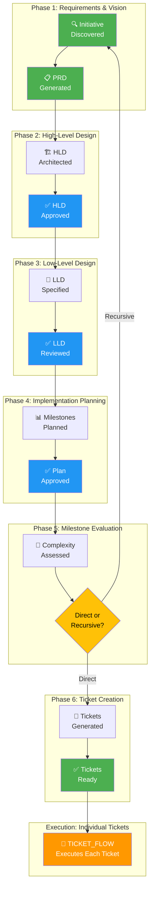

# SDLC Initiative Planning Guide

**Version:** 1.0  
**Last Updated:** January 27, 2026  
**Scope:** Full Software Development Lifecycle for Larger Projects  
**Integration:** Builds on [TICKET_FLOW.md](TICKET_FLOW.md) for individual ticket execution

---

## Overview

This guide describes a comprehensive Software Development Lifecycle (SDLC) process for larger initiatives that span multiple teams and deliverable milestones. It provides a framework for breaking down complex projects into manageable, iterative pieces while maintaining alignment with the original vision.

**Key Principles:**
- 🎯 **Hierarchical Decomposition:** Large projects break down into phases, milestones, and iterative cycles
- 🔄 **Recursive SDLC:** Each milestone can trigger its own mini-SDLC if detail is needed
- 📊 **Clear Deliverables:** Every phase produces discrete, measurable outcomes
- 🔗 **Traceability:** Requirements flow from PRD → Design → Implementation → Tickets
- 👥 **Agent-Driven:** Each phase has dedicated agents to automate heavy lifting
- ✅ **Quality Gates:** Checkpoints prevent rework and scope creep

---

## Table of Contents

1. [Overview](#overview)
2. [Agents & Roles](#agents--roles)
3. [Phase 1: Requirements & Vision](#phase-1-requirements--vision)
4. [Phase 2: High-Level Design](#phase-2-high-level-design)
5. [Phase 3: Low-Level Design](#phase-3-low-level-design)
6. [Phase 4: Implementation Planning](#phase-4-implementation-planning)
7. [Phase 5: Milestone Evaluation & Decomposition](#phase-5-milestone-evaluation--decomposition)
8. [Phase 6: Ticket Creation & Distribution](#phase-6-ticket-creation--distribution)
9. [Complete Initiative Workflow](#complete-initiative-workflow)
10. [Multi-Level Hierarchy Examples](#multi-level-hierarchy-examples)
11. [Best Practices](#best-practices)

---

## Agents & Roles

### Agent Overview

| Agent | Mode | Phase | Responsibility |
|-------|------|-------|-----------------|
| `initiative-discoverer` | Read-only | Phase 1 | Identify and scope new initiatives |
| `prd-generator` | Writer | Phase 1 | Create Product Requirements Document |
| `hld-generator` | Writer | Phase 2 | Generate High-Level Design artifact |
| `lld-generator` | Writer | Phase 3 | Generate Low-Level Design specifications |
| `implementation-planner` | Writer | Phase 4 | Break down into milestones & deliverables |
| `milestone-evaluator` | Analyzer | Phase 5 | Assess if milestone needs recursive SDLC |
| `ticket-generator` | Writer | Phase 6 | Create GitHub Issues/Jira tickets from tickets |
| `ticket-workflow-executor` | Executor | Ongoing | Executes individual tickets (see [TICKET_FLOW.md](TICKET_FLOW.md)) |

### Agent Definitions

**`initiative-discoverer`**
- **Purpose:** Scan backlog for new initiatives and validate readiness
- **Inputs:** Product roadmap, stakeholder feedback, strategic goals
- **Outputs:** Initiative summary with business case, stakeholders, timeline estimate
- **Quality Gate:** Business case is clear and measurable

**`prd-generator`**
- **Purpose:** Create comprehensive Product Requirements Document
- **Inputs:** Initiative summary, stakeholder interviews, market research
- **Outputs:** `docs/prd/{{INITIATIVE_ID}}-prd.md` with:
  - Business goals & success metrics
  - User personas & journey maps
  - Functional requirements (with priority)
  - Non-functional requirements
  - Constraints & assumptions
  - Out-of-scope clarifications
- **Quality Gate:** All personas covered, success metrics measurable, no ambiguities

**`hld-generator`**
- **Purpose:** Create High-Level Design from requirements
- **Inputs:** PRD, architecture guidelines, existing systems
- **Outputs:** `docs/design/hld/{{INITIATIVE_ID}}-hld.md` with:
  - System architecture diagram
  - Major components & interactions
  - Technology decisions & rationale
  - Data model (conceptual)
  - Security & compliance approach
  - Integration points with existing systems
  - High-level API contracts
- **Quality Gate:** Architecture is defensible, no unknowns remain

**`lld-generator`**
- **Purpose:** Create detailed Low-Level Design specifications
- **Inputs:** HLD, PRD, code standards
- **Outputs:** `docs/design/lld/{{INITIATIVE_ID}}-lld.md` with:
  - Detailed component specifications
  - Class/module diagrams
  - API specifications (with schemas)
  - Database schema (normalized)
  - Error handling & logging strategy
  - Configuration & feature flags
  - Test strategy & test cases
  - Performance & scalability targets
- **Quality Gate:** Design is implementation-ready, developers can code from this

**`implementation-planner`**
- **Purpose:** Break LLD into milestones & discrete deliverables
- **Inputs:** LLD, team capacity, timeline, dependencies
- **Outputs:** `docs/plan/{{INITIATIVE_ID}}-implementation.md` with:
  - Milestone breakdown (M1, M2, M3, ...)
  - For each milestone:
    - Objectives & acceptance criteria
    - Components/features included
    - Estimated effort & duration
    - Dependencies on other milestones
    - Success metrics
    - Rollout/deployment plan
- **Quality Gate:** Milestones are independent & parallelizable where possible

**`milestone-evaluator`**
- **Purpose:** Assess if milestone needs recursive mini-SDLC
- **Inputs:** Milestone specification, complexity score, team familiarity
- **Outputs:** Evaluation report with:
  - Complexity rating (Low/Medium/High)
  - Recommendation (Direct → Tickets OR Recursive SDLC)
  - Rationale for decomposition
  - If recursive: Sub-initiatives to follow full SDLC
- **Quality Gate:** Recommendation is justified by criteria

**`ticket-generator`**
- **Purpose:** Create granular tickets from milestone specifications
- **Inputs:** Milestone spec, LLD, acceptance criteria, effort estimates
- **Outputs:** GitHub Issues or Jira tickets with:
  - Title following convention: `[{{INITIATIVE_ID}}] {{TITLE}}`
  - Full description with context
  - Linked to parent milestone
  - Story points & priority
  - AC checklist from LLD
  - Labels (component, type, etc.)
  - Dependencies between tickets
- **Quality Gate:** Tickets are executable by `ticket-workflow-executor`

---

## Phase 1: Requirements & Vision

### Step 1.1: Initiative Discovery
**Agent:** `initiative-discoverer`  
**Type:** Read-only scanner  
**Purpose:** Identify and vet new initiatives for SDLC

**What it does:**
- Scans product backlog for new strategic initiatives
- Validates business case exists
- Gathers stakeholder information
- Identifies timeline & team constraints
- Prioritizes relative to other initiatives

**Input:**
```
Product backlog, roadmap, stakeholder requests
```

**Output:**
```
Initiative Summary:
- ID: INIT-2026-001 (or similar)
- Name: User Authentication System
- Business Case: Reduce support tickets by 40%
- Key Stakeholders: [list]
- Estimated Scope: Large (3-4 months)
- Timeline Constraint: Q1 2026
- Team Availability: 2-3 engineers
```

**Next Step:**
→ **Step 1.2: PRD Generation**

### Step 1.2: PRD Generation
**Agent:** `prd-generator`  
**Type:** Writer  
**Purpose:** Create comprehensive Product Requirements Document

**What it does:**
- Interviews stakeholders & product managers
- Reviews market research & competitor analysis
- Defines user personas & journey maps
- Documents functional & non-functional requirements
- Clarifies constraints, assumptions, out-of-scope items

**Input:**
```
Initiative ID: INIT-2026-001
Initiative Summary: [from Step 1.1]
Stakeholder Contacts: [list with context]
```

**Output:**
```
PRD File: docs/prd/INIT-2026-001-prd.md
  - Executive Summary
  - Business Objectives & Success Metrics
  - User Personas (with journey maps)
  - Functional Requirements (prioritized: MUST/SHOULD/COULD)
  - Non-Functional Requirements (perf, security, compliance)
  - Constraints & Assumptions
  - Out-of-Scope (explicit)
  - Open Questions (tracked for closure)
```

**Quality Gate Checklist:**
- [ ] All personas documented with journeys
- [ ] Success metrics are SMART (specific, measurable, achievable, relevant, time-bound)
- [ ] Functional requirements prioritized (MoSCoW method)
- [ ] NFRs quantified (latency, throughput, availability targets)
- [ ] No ambiguous language ("intuitive", "user-friendly")
- [ ] Out-of-scope items explicitly listed
- [ ] Stakeholder sign-off obtained

**Next Step:**
→ **Phase 2: Step 2.1 High-Level Design**

---

## Phase 2: High-Level Design

### Step 2.1: High-Level Design Generation
**Agent:** `hld-generator`  
**Type:** Writer  
**Purpose:** Create system architecture from PRD

**What it does:**
- Analyzes PRD to understand user needs & functional scope
- Reviews existing systems & architecture patterns
- Designs major components & their interactions
- Documents technology decisions with rationale
- Specifies integration points
- Creates security & compliance strategy
- Designs conceptual data model

**Input:**
```
PRD File: docs/prd/INIT-2026-001-prd.md
Architecture Guidelines: [from org]
Existing Systems: [reference docs]
```

**Output:**
```
HLD File: docs/design/hld/INIT-2026-001-hld.md
  - System Architecture Diagram (boxes & arrows)
  - Major Components (with responsibility)
  - Component Interactions (sequence diagrams)
  - Technology Stack Decisions (with trade-offs)
  - Conceptual Data Model (entity relationships)
  - Security & Compliance Strategy
  - Integration Points (external systems)
  - High-Level API Contracts (REST/gRPC/etc)
  - Deployment Architecture
  - Scalability Approach
```

**Quality Gate Checklist:**
- [ ] Architecture is defensible (trade-offs documented)
- [ ] No single point of failure identified
- [ ] Technology decisions reviewed by architects
- [ ] Integration points with existing systems clear
- [ ] Security approach covers data, auth, encryption
- [ ] Scalability targets align with NFRs
- [ ] Deployment strategy defined (phased rollout?)
- [ ] Architect review & approval obtained

**Next Step:**
→ **Phase 3: Step 3.1 Low-Level Design**

---

## Phase 3: Low-Level Design

### Step 3.1: Low-Level Design Generation
**Agent:** `lld-generator`  
**Type:** Writer  
**Purpose:** Create implementation-ready design specifications

**What it does:**
- Takes HLD components and details each one
- Designs class/module structure & interactions
- Specifies API endpoints with request/response schemas
- Designs normalized database schema
- Documents error handling & logging strategy
- Specifies configuration & feature flags
- Creates detailed test strategy
- Defines performance & scalability targets

**Input:**
```
HLD File: docs/design/hld/INIT-2026-001-hld.md
PRD File: docs/prd/INIT-2026-001-prd.md
Code Standards: [from org]
```

**Output:**
```
LLD File: docs/design/lld/INIT-2026-001-lld.md
  - Module/Package Structure
  - Class Diagrams & Responsibilities
  - API Specification (per endpoint):
    - Request schema (JSON schema)
    - Response schema (with error cases)
    - Status codes & error handling
    - Rate limiting & timeout strategy
  - Database Schema (with migrations)
  - Error Handling Framework
  - Logging Strategy
  - Configuration (env vars, feature flags)
  - Test Strategy:
    - Unit test coverage targets
    - Integration tests (scenarios)
    - Contract tests
    - Performance tests (if applicable)
  - Performance Targets:
    - P50, P99 latency
    - Throughput (requests/sec)
    - Memory & CPU usage
  - Monitoring & Observability
  - Security Implementation Details
```

**Quality Gate Checklist:**
- [ ] API contracts are versioning-aware
- [ ] Database schema is normalized (NF3+)
- [ ] Error handling covers all failure modes
- [ ] Logging includes correlation IDs & context
- [ ] Feature flags identified for safe rollout
- [ ] Test strategy covers happy & sad paths
- [ ] Performance targets are realistic & measurable
- [ ] Senior engineer review completed
- [ ] No ambiguities remain for implementation

**Next Step:**
→ **Phase 4: Step 4.1 Implementation Planning**

---

## Phase 4: Implementation Planning

### Step 4.1: Implementation Plan Generation
**Agent:** `implementation-planner`  
**Type:** Writer  
**Purpose:** Break LLD into executable milestones

**What it does:**
- Analyzes LLD to identify independent components
- Groups components into logical milestones
- Estimates effort & duration for each
- Maps dependencies between milestones
- Defines success metrics per milestone
- Plans rollout & deployment strategy
- Identifies team & skill requirements

**Input:**
```
LLD File: docs/design/lld/INIT-2026-001-lld.md
Team Capacity: [engineers available, skills]
Timeline: Q1 2026
Risk Factors: [dependencies, constraints]
```

**Output:**
```
Implementation Plan: docs/plan/INIT-2026-001-implementation.md
  - Overall Timeline & Critical Path
  - Milestone Breakdown:
    
    M1: Core Authentication Service (4-6 weeks)
      Objectives: "Users can register, login, logout"
      Components: Auth service, password hashing, session management
      Acceptance Criteria: [AC1, AC2, ...]
      Estimated SP: 40
      Dependencies: None (critical path)
      Success Metrics: Latency <100ms, 99.9% uptime
      Rollout: Internal users → Beta → GA
      
    M2: Authorization & Permissions (3-4 weeks)
      Objectives: "Users have role-based access control"
      Components: Permission service, role definitions, audit logs
      Acceptance Criteria: [AC1, AC2, ...]
      Estimated SP: 32
      Dependencies: M1 (core auth must work)
      Success Metrics: Audit log 100% coverage
      Rollout: GA after M1
      
    M3: Multi-Factor Authentication (2-3 weeks)
      Objectives: "Users can enable 2FA for accounts"
      Components: MFA service, SMS/email delivery, backup codes
      Acceptance Criteria: [AC1, AC2, ...]
      Estimated SP: 24
      Dependencies: M1 (auth must exist)
      Success Metrics: Adoption rate >50%
      Rollout: Optional feature, GA
      
    M4: Admin Dashboard (3-4 weeks)
      Objectives: "Admins can manage users, audit logs, policies"
      Components: Admin API, UI, reporting
      Acceptance Criteria: [AC1, AC2, ...]
      Estimated SP: 36
      Dependencies: M1, M2 (auth & permissions)
      Success Metrics: Admin tasks <5min per task
      Rollout: Internal use → GA
  
  - Parallel Work: M2 & M3 can start after M1
  - Critical Path: M1 → M2 → M4
  - Total Duration: 12-18 weeks
  - Team Capacity: 2.5 FTE engineers + 1 QA
```

**Quality Gate Checklist:**
- [ ] Milestones are independently valuable
- [ ] Each milestone has success metrics
- [ ] Dependencies are explicit
- [ ] Effort estimates are time-boxed
- [ ] Rollout strategy is low-risk (canary/blue-green)
- [ ] Critical path is identified
- [ ] Parallel opportunities identified
- [ ] Team capacity planning completed
- [ ] Stakeholder alignment obtained

**Next Step:**
→ **Phase 5: Step 5.1 Milestone Evaluation**

---

## Phase 5: Milestone Evaluation & Decomposition

### Step 5.1: Milestone Evaluation
**Agent:** `milestone-evaluator`  
**Type:** Analyzer  
**Purpose:** Determine if milestone needs recursive SDLC or direct ticket creation

**What it does:**
- Scores milestone complexity (Low/Medium/High)
- Assesses team familiarity with components
- Evaluates if additional design depth needed
- Recommends: Direct Tickets OR Recursive Mini-SDLC
- If recursive: Outlines sub-initiatives

**Complexity Scoring Criteria:**

| Factor | Low | Medium | High |
|--------|-----|--------|------|
| **Components** | 1-2 | 3-5 | 6+ |
| **APIs** | <5 | 5-15 | 15+ |
| **DB Schema** | <10 tables | 10-30 tables | 30+ tables |
| **Integration Points** | 0 | 1-2 | 3+ |
| **Data Processing** | Simple CRUD | Workflow logic | Complex algorithms |
| **Team Familiarity** | Familiar | Somewhat familiar | Unfamiliar |
| **Tech Stack Novelty** | Proven | Mostly proven | New/experimental |

**Input:**
```
Milestone Specification: [from Phase 4]
Team Skills & Experience: [inventory]
Code Complexity Assessment: [tools output]
```

**Output:**
```
Evaluation Report: docs/evaluation/INIT-2026-001-M1-eval.md
  
  Complexity Score: 32/50 → MEDIUM complexity
  
  Recommendation: DIRECT → TICKETS
  Rationale:
    - Core auth is well-established pattern
    - Team has PostgreSQL expertise
    - APIs are standard REST endpoints
    - Estimated to need 5-8 tickets
  
  OR (if HIGH complexity):
  
  Recommendation: RECURSIVE SDLC
  Rationale:
    - Custom workflow engine needed
    - Permission model is complex
    - Team unfamiliar with graph databases
    - Recommend mini-PRD, mini-HLD, mini-LLD
  
  Sub-Initiatives (if recursive):
    - Sub-Init 1: Workflow Engine Design
    - Sub-Init 2: Permission Graph Model
    - Sub-Init 3: Audit Trail System
    
  These follow the full SDLC on smaller scale
```

**Quality Gate Checklist:**
- [ ] Complexity score is justified
- [ ] Recommendation includes rationale
- [ ] If recursive, sub-initiatives are clear
- [ ] Timeline impact assessed
- [ ] Risk mitigation identified
- [ ] Team lead agreement obtained

**Next Step (If DIRECT):**
→ **Phase 6: Step 6.1 Ticket Generation**

**Next Step (If RECURSIVE):**
→ **Re-enter Phase 1** for each sub-initiative

---

## Phase 6: Ticket Creation & Distribution

### Step 6.1: Ticket Generation
**Agent:** `ticket-generator`  
**Type:** Writer  
**Purpose:** Create granular, executable tickets from milestone specifications

**What it does:**
- Breaks milestone into discrete user stories & tasks
- Creates tickets with full context & AC
- Establishes dependencies between tickets
- Assigns story points & priority
- Links to parent milestone & initiative
- Tags with component, type, etc.

**Input:**
```
Milestone Specification: [from Phase 4]
LLD Excerpt: [relevant design section]
Evaluation Result: DIRECT TICKETS [from Phase 5]
```

**Output (Example M1 Breakdown):**
```
Tickets Created: 8 tickets for Auth Service milestone

[INIT-2026-001-AUTH-01] Password Hashing & Storage
  Type: Story
  SP: 5
  AC:
    - [ ] bcrypt v2b with cost=12 implemented
    - [ ] Password validation rules enforced
    - [ ] Migration: hash existing plaintext (async)
    - [ ] No plaintext in logs/errors
  Linked to: M1 Core Authentication Service
  Dependencies: None
  Component: auth-service/security

[INIT-2026-001-AUTH-02] User Registration API
  Type: Story
  SP: 5
  AC:
    - [ ] POST /api/v1/auth/register endpoint
    - [ ] Email validation (RFC 5322)
    - [ ] Duplicate email check
    - [ ] Email verification link sent
    - [ ] 200ms P99 latency achieved
  Linked to: M1
  Dependencies: AUTH-01
  Component: auth-service/api

[And 6 more tickets...]

Total SP for M1: 50 (aligned with plan)
Recommended Sprint Structure: 2-week sprints
  Sprint 1: AUTH-01, AUTH-02, AUTH-03
  Sprint 2: AUTH-04, AUTH-05, AUTH-06
  Sprint 3: AUTH-07, AUTH-08
```

**Quality Gate Checklist:**
- [ ] All tickets follow naming convention
- [ ] Story points sum to milestone estimate
- [ ] Dependencies are explicitly linked
- [ ] AC are testable (no subjective language)
- [ ] Each ticket <13 SP (splittable if larger)
- [ ] No duplicate work
- [ ] Acceptance criteria map to LLD
- [ ] Tech lead approval obtained

**Next Step:**
→ **Ticket Execution via [TICKET_FLOW.md](TICKET_FLOW.md)**

---

## Complete Initiative Workflow



---

## Multi-Level Hierarchy Examples

### Example 1: Simple Initiative (Direct Tickets)

```
Initiative: INIT-2026-001 (User Authentication)
├── Phase 1: Requirements
│   └── PRD: 20 pages, clear requirements
├── Phase 2: Design
│   └── HLD: Standard auth patterns
├── Phase 3: Design Detail
│   └── LLD: Detailed API specs
├── Phase 4: Planning
│   └── 1 Milestone: M1 Core Auth (50 SP)
├── Phase 5: Evaluation
│   └── Complexity: MEDIUM
│   └── Recommendation: DIRECT TICKETS
└── Phase 6: Tickets
    ├── AUTH-01 through AUTH-08 (8 tickets, 50 SP)
    └── Executed via TICKET_FLOW
```

### Example 2: Complex Initiative (Recursive SDLC)

```
Initiative: INIT-2026-002 (Advanced Payment System)
├── Phase 1: Requirements
│   └── PRD: 50 pages, complex workflows
├── Phase 2: Design
│   └── HLD: Multi-service architecture
├── Phase 3: Design Detail
│   └── LLD: Complex state machines
├── Phase 4: Planning
│   ├── M1: Payment Processing (60 SP)
│   ├── M2: Reconciliation Engine (80 SP)
│   └── M3: Fraud Detection (100 SP)
├── Phase 5: Evaluation
│   ├── M1: Complexity MEDIUM → DIRECT TICKETS
│   ├── M2: Complexity HIGH → RECURSIVE SDLC ⚠️
│   └── M3: Complexity HIGH → RECURSIVE SDLC ⚠️
└── Phase 6: Tickets
    ├── M1 Tickets (PAYMENT-01 through PAYMENT-06)
    ├── Sub-Initiative 1: INIT-2026-002-M2 (Reconciliation Engine)
    │   └── Full SDLC (PRD → HLD → LLD → Planning → Tickets)
    └── Sub-Initiative 2: INIT-2026-002-M3 (Fraud Detection)
        └── Full SDLC (PRD → HLD → LLD → Planning → Tickets)
```

### Example 3: Hierarchical Decomposition

```
Initiative: INIT-2026-003 (E-Commerce Platform)
├── Level 1: Full SDLC
│   ├── PRD: 60 pages
│   ├── HLD: 3 major services
│   ├── LLD: 50 pages
│   └── Planning: 6 milestones
│
├── M1: Product Catalog (Level 2)
│   ├── Complexity: MEDIUM
│   ├── Tickets: 12 (direct)
│   └── No recursion
│
├── M2: Shopping Cart & Checkout (Level 2)
│   ├── Complexity: HIGH
│   ├── Recursive Mini-SDLC:
│   │   ├── Sub-PRD: Cart behavior
│   │   ├── Sub-HLD: Cart service design
│   │   ├── Sub-LLD: API spec for cart
│   │   └── Sub-Planning: 2 sub-milestones
│   │       ├── M2.1: Basic Cart (Level 3)
│   │       │   ├── Complexity: MEDIUM
│   │       │   └── Tickets: 8 (direct)
│   │       └── M2.2: Checkout Flow (Level 3)
│   │           ├── Complexity: HIGH
│   │           ├── Recursive Mini-SDLC (Level 4)...
│   │           └── Sub-tickets: 10
│   └── Execution: TICKET_FLOW per ticket
│
├── M3: Payment Integration (Level 2)
│   ├── Complexity: HIGH
│   ├── Recursive Mini-SDLC (similar structure)
│   └── Execution: TICKET_FLOW per ticket
│
├── M4: Order Management (Level 2)
│   └── ...
│
└── M5: Reporting & Analytics (Level 2)
    └── ...
```

---

## Best Practices

### 1. Phase Gate Reviews

Each phase should end with a **gate review** before proceeding.

### 2. Recursive SDLC Decision Criteria

When to use **recursive SDLC** for a milestone: HIGH complexity, unfamiliar patterns, cross-team coordination, critical path items.

### 3. Traceability Matrix

Maintain a **traceability matrix** showing Requirements → Design → Tests → Tickets.

### 4. Risk Management

Identify risks at **Phase 4** (Planning) stage.

### 5. Communication Plan

For each phase, communicate with stakeholders, teams, and leadership.

### 6. Metrics & Tracking

Track key metrics: scope adherence, timeline variance, quality metrics, team velocity.

### 7. Documentation Standards

Every phase produces a document with consistent naming, versioning, and sign-off.

---

## Integration with Ticket Execution

Once tickets are created, execution follows the **[TICKET_FLOW.md](TICKET_FLOW.md)** process.

---

## Summary

This SDLC Initiative Planning guide provides:

1. **Scalable Framework:** From small projects to enterprise initiatives
2. **Agent-Driven Automation:** Each phase has dedicated agents
3. **Quality Gates:** Prevent rework through clear phase reviews
4. **Recursive Flexibility:** Complex milestones get their own mini-SDLC
5. **Traceability:** Requirements flow through design → tickets → execution
6. **Clear Decomposition:** Initiatives → Milestones → Tickets → Individual work
7. **Integration:** Seamless handoff to [TICKET_FLOW.md](TICKET_FLOW.md)

**Philosophy:** Structure, clarity, and automation at initiative level enable speed and quality at execution level.

---

**Last Updated:** January 27, 2026  
**Version:** 1.0  
**Status:** Ready for review & adoption
