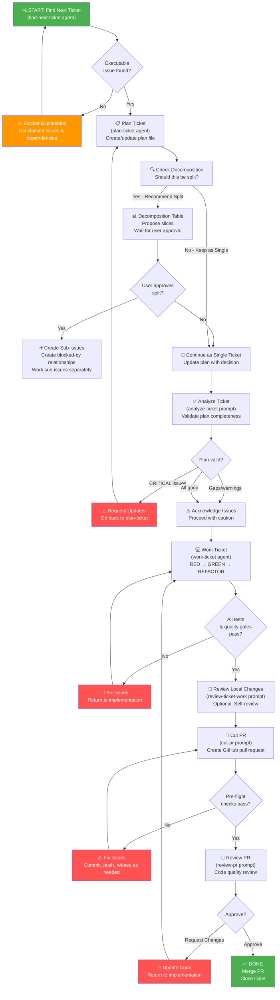

# Ticket Flow: End-to-End Workflow Guide

**Version:** 1.0  
**Last Updated:** January 26, 2026  
**Scope:** GitHub Issues & Jira Tickets

---

## Overview

This guide describes the complete workflow for working a GitHub Issue or Jira ticket from discovery through resolution, using the agent-templates system.

**Quick Reference:**
```
find-next-ticket → plan-ticket → analyze-ticket → work-ticket → review-ticket-work → cut-pr → review-pr → ✅ Done
```

---

## Phase 1: Discovery & Selection

### Step 1.1: Find Next Ticket
**Mode:** `find-next-ticket`  
**Type:** Agent (read-only)  
**Purpose:** Identify the single next executable issue

**What it does:**
- Scans GitHub issues by dependency ordering
- Prioritizes by milestone, then priority labels, then issue number
- Respects blocking dependencies (blocked-by links)
- Returns ONLY a single issue number

**Input:**
```
find-next-ticket mode is active
No inputs required (optional: ask for assignee preference)
```

**Output:**
```
#<issue-number>
```

**Next Step:**
→ Move to **Step 2.1: Plan Ticket**

**Scenario: No Issue Found**
If no executable issue exists, `find-next-ticket` returns a blocker explanation:
- Lists earliest blocked issue
- Shows its blockers and statuses
- Indicates what needs to complete first

**Action:** Unblock the ticket or select a different workflow phase

---

## Phase 2: Planning

### Step 2.1: Plan Ticket
**Mode:** `plan-ticket`  
**Type:** Agent (writes plan file)  
**Purpose:** Create an execution-ready implementation plan using TDD

**What it does:**
- Fetches ticket details (GitHub or Jira)
- Creates/updates `docs/plan/tickets/{{TICKET_ID}}-plan.md` with:
  1. Problem statement
  2. In-scope vs. out-of-scope
  3. Acceptance criteria (normalized)
  4. Non-functional requirements (perf, security, compliance)
  5. Dependencies & blockers
  6. **Decomposition evaluation** (critical check)
  7. Reusable patterns discovered
  8. Test strategy (unit/integration/contract tests)
  9. Implementation phases
  10. Quality gates & acceptance criteria traceability
  11. Rollout & observability plan

**Input:**
```
Ticket Identifier: {{TICKET_ID}} (required)
Additional Links: {{OPTIONAL_REFS}} (optional)
Target Date/Milestone: {{TARGET_DATE}} (optional)
```

**Output:**
```
Plan file: docs/plan/tickets/{{TICKET_ID}}-plan.md
  - 11 required sections
  - TDD test cases documented
  - Reusable patterns identified with file citations
  - Phase breakdown with estimated effort
  - Decomposition recommendation (if applicable)
```

**Key Responsibilities (Plan):**
- Creates or updates plan on disk
- Searches codebase for reusable patterns
- **Evaluates decomposition needs** (see critical check below)
- Documents decomposition if splitting recommended
- Proposes sub-issues if applicable (with user approval only)
- Does NOT create sub-issues automatically

### Critical: Decomposition Check

Before finalizing the plan, **ALWAYS evaluate decomposition**:

**When to decompose (split into sub-issues):**
- ✅ Work spans >3-5 days of effort
- ✅ Multiple separable functional capabilities
- ✅ Cross-layer changes (API + data + infrastructure)
- ✅ Work parallelizable (clear dependency DAG)
- ✅ Risk unblocking other work by slicing
- ✅ >5 acceptance criteria (complex scope)

**Decomposition output (if recommended):**

| Slice | Title | Type | Rationale | ACs | Depends | Effort |
|-------|-------|------|-----------|-----|---------|--------|
| 1 | ... | Feature | ... | ... | None | S/M/L |
| 2 | ... | Feature | ... | ... | #1 | S/M/L |
| 3 | ... | Feature | ... | ... | #1, #2 | S/M/L |

**Action if decomposition recommended:**
1. Document in plan file (Section 6)
2. Inform user: "Recommend splitting into 3 slices"
3. **Wait for user approval** before creating sub-issues
4. If approved: Create sub-issues with blocked-by relationships
5. If rejected: Proceed with single ticket

**When to keep as single ticket:**
- ✅ <3 days effort
- ✅ Single functional capability
- ✅ Single-layer change
- ✅ <3 acceptance criteria
- ✅ No decomposition complexity

**Next Step:**
→ **Step 3.1: Analyze Ticket** (validate plan)

**Plan Validation Checklist:**
- [ ] All acceptance criteria documented
- [ ] Decomposition evaluated (split or keep as-is)
- [ ] Test strategy matches TDD approach
- [ ] Phases align with ticket scope
- [ ] Quality gates defined
- [ ] Rollout/observability plan present
- [ ] Reusable patterns cited

---

## Phase 3: Analysis & Understanding

### Step 3.1: Analyze Ticket
**Mode:** `analyze-ticket`  
**Type:** Prompt  
**Purpose:** Validate the ticket plan and identify gaps

**What it does:**
- Loads ticket details (GitHub or Jira)
- Fetches or creates the plan file (`docs/plan/tickets/{{TICKET_ID}}-plan.md`)
- Validates plan completeness:
  - All acceptance criteria covered
  - No uncovered edge cases
  - Reasonable scope (single deliverable or justified decomposition)
- Identifies issues: blockers, ambiguities, risks

**Input:**
```
Ticket Identifier: {{TICKET_ID}}
  (GitHub: numeric #123)
  (Jira: alphanumeric KEY-456)
```

**Output:**
```
Analysis Report (Markdown):
- AC Coverage: [table of acceptance criteria]
- Coverage Gaps: [list of missing coverage]
- Risk Assessment: [CRITICAL/HIGH/MEDIUM/LOW issues]
- Decomposition Evaluation: [plan recommends split or keep as-is]
- Severity: [CRITICAL/HIGH/MEDIUM/LOW]
- Remediation: [suggested fixes]
```

**Decision Point:**
- ✅ Plan is complete and valid → **Step 4.1: Work Ticket**
- 🔴 Plan has CRITICAL issues → Request plan updates or re-plan
- 🟡 Plan has gaps → Author can update plan or proceed with caveats
- 💡 Decomposition review → Confirm recommendation (split or keep as-is)

**Key Questions to Answer:**
- Is the plan missing any acceptance criteria?
- Are there edge cases not covered?
- Is the decomposition recommendation sound?
- Are all dependencies clear?

**Next Step:**
→ **Step 4.1: Work Ticket** (implement the plan)

### Step 4.1: Work Ticket
**Mode:** `work-ticket`  
**Type:** Agent (writes production code)  
**Purpose:** Execute the plan with strict TDD and quality gates

**What it does:**
- Loads plan from disk (`docs/plan/tickets/{{TICKET_ID}}-plan.md`)
- Follows TDD cycle:
  1. **RED:** Write meaningful tests first (unit, integration, contract)
  2. **GREEN:** Write minimal code to pass tests
  3. **REFACTOR:** Safety refactor while keeping tests green
- Implements each phase in sequence
- Runs quality gates after each phase:
  - All tests pass (unit + integration)
  - Linting passes (project-specific linters)
  - Duplication scan (local; Codacy for detailed analysis)
  - Complexity check (method length, nesting, cyclomatic)
- Updates GitHub/Jira issue status as work progresses

**Input:**
```
Ticket Identifier: {{TICKET_ID}} (required)
Plan File Path: docs/plan/tickets/{{TICKET_ID}}-plan.md (auto-detected)
```

**Output:**
```
✅ All tests pass
✅ All linters pass
✅ No quality gate failures
✅ Implementation complete
✅ GitHub/Jira status updated

Files modified: [list]
Tests written: [count]
Coverage: [percentage]
```

**Implementation Phases (from plan):**

| Phase | Focus | Output |
|-------|-------|--------|
| 2 (RED) | Unit tests (nominal, boundary, error) | Test suite with all tests failing |
| 2 (RED) | Integration tests (containers/mocks) | Integration test suite failing |
| 2 (RED) | Contract/API tests | Contract tests failing |
| 2 (RED) | Regression tests | Regression tests failing |
| 3 (GREEN) | Domain / DTOs | Code passes tests |
| 3 (GREEN) | Service interfaces + impls | Code passes tests |
| 3 (GREEN) | Data layer (repos, indexes) | Code passes tests |
| 3 (GREEN) | Controllers / API | Code passes tests |
| 3 (GREEN) | Config / env vars | Code passes tests |
| 3 (GREEN) | Migrations (backward compatible) | Code passes tests |
| 3 (GREEN) | Feature flags (default OFF) | Code passes tests |
| 4 | Docs & Artifacts | README, CHANGELOG, runbooks updated |
| 5 | Quality Gates | All checks pass |

**Quality Gates (Phase 5):**
- ✅ Build succeeds
- ✅ Unit tests pass
- ✅ Integration tests pass
- ✅ Contract tests pass
- ✅ All linters pass (ESLint, Spotless, Markdownlint, etc.)
- ✅ Schema drift check (if applicable)
- ✅ Security/input validation review
- ✅ Feature flags default OFF (if used)
- ✅ Coverage maintained or improved
- ✅ Duplication scan (local; Codacy comprehensive)
- ✅ Complexity checks pass

**When to Stop & Review:**
- Test failure → Fix root cause, don't dilute tests
- Quality gate failure → Remediate before continuing
- Scope creep → Pause and discuss with user
- Blocker discovered → Document and escalate

**Next Step:**
→ **Step 5.1: Review Local Changes** OR **Step 5.2: Cut PR** (if confident)

---

## Phase 5: Review & Submission

### Step 5.1: Review Ticket Work (Optional)
**Mode:** `review-ticket-work`  
**Type:** Prompt  
**Purpose:** Self-review local changes before pushing

**What it does:**
- Loads ticket from GitHub/Jira
- Fetches current local changes
- Validates each acceptance criterion against implementation
- Checks for duplication and complexity issues
- Confirms all quality gates met

**Input:**
```
Ticket Identifier: {{TICKET_ID}} (required)
```

**Output:**
```
Review Report (Markdown):
- AC Coverage: [table mapping ACs to code]
- Quality Issues: [linting, duplication, complexity]
- Missing Tests: [coverage gaps]
- Recommendations: [before pushing]
```

**Decision:**
- ✅ All checks pass → **Step 5.2: Cut PR**
- 🔴 Issues found → Fix and re-review
- 💡 Improvements suggested → Apply and re-review

**When to Skip:**
- If confident in work quality
- If CI/CD will catch issues (not recommended)
- If proceeding to PR review is acceptable

### Step 5.2: Cut PR
**Mode:** `cut-pr` (Prompt)  
**Type:** Prompt  
**Purpose:** Create a pull request from current branch

**What it does:**
- Validates branch is clean and up-to-date
- Auto-detects ticket ID from branch name (if present)
- Generates semantic PR title: `<type>(<scope>): #<TICKET_ID> <summary>`
- Fetches repository PR template (if exists)
- Creates PR with automated title and description
- Links to GitHub issue automatically

**Input:**
```
Current Branch: (auto-detected)
Ticket ID: (auto-detected from branch name or provided)
Additional Comments: {{OPTIONAL}} (for PR notes)
```

**Output:**
```
✅ PR Created
PR URL: https://github.com/owner/repo/pull/123
Title: feat(api): #456 add user authentication endpoint
Status: Open (ready for review)
```

**Pre-flight Checks (Phase 0):**
- ✅ No uncommitted changes
- ✅ All commits pushed to remote
- ✅ Branch is up to date with default branch
- ✅ No merge conflicts
- ✅ Branch ≠ default branch

**If Pre-flight Checks Fail:**
- Uncommitted changes → Commit and push first
- Unpushed commits → Push changes
- Branch behind default → Pull latest
- Merge conflicts → Resolve manually
- On default branch → Create feature branch first

**Next Step:**
→ **Step 6.1: Review PR** (external review) OR Done (if auto-merge enabled)

---

### Step 6.1: Review Pull Request
**Mode:** `review-pr` (Prompt)  
**Type:** Prompt  
**Purpose:** Final review before merge (can be external reviewer or self-review)

**What it does:**
- Loads ticket from GitHub/Jira (for acceptance criteria)
- Fetches PR details and code diff
- Maps each AC to code changes
- Reviews code quality:
  - Readability & maintainability
  - Design & architecture
  - Error handling
  - Security considerations
- Checks for duplication
- Assesses complexity
- Reviews business logic clarity

**Input:**
```
Ticket Identifier: {{TICKET_ID}} (required)
Pull Request: {{PR_URL_OR_OWNER/REPO#NUMBER}} (required)
```

**Output:**
```
Review Report (Markdown):
- AC Coverage: [table of AC validation]
- Code Quality Issues: [severity + recommendations]
- Duplication Found: [if any, with suggestions]
- Complexity Assessment: [methods > 20 lines, nesting > 3, etc.]
- Security Review: [credentials, input validation, etc.]
- Business Logic: [clarity assessment]
- Recommendation: [APPROVE / REQUEST_CHANGES / COMMENT]
```

**Severity Levels:**
- 🔴 **CRITICAL/Blocking:** Must resolve before merge
- 🟡 **HIGH:** Should address; significant impact
- 🟢 **MEDIUM:** Nice-to-have; improves quality
- 💡 **LOW:** Highlights or documentation

**Actions:**
- ✅ All checks pass → Approve PR
- 🔴 Critical issues → Request changes (block merge)
- 🟡 High priority items → Comment (can merge with follow-up)
- 💡 Low priority → Comment (informational)

**Next Step:**
→ **Done** (if approved) OR Back to **Step 4.1: Work Ticket** (if changes needed)

---

## Complete Workflow Diagram



---

## Scenario-Based Flows

### Scenario A: Happy Path (Start to Finish)
```
1. find-next-ticket → returns #42
2. plan-ticket #42 → creates plan file, no decomposition needed
3. analyze-ticket #42 → plan is valid
4. work-ticket #42 → all tests pass, quality gates pass
5. (optional) review-ticket-work #42 → no issues
6. cut-pr → PR #123 created
7. review-pr → approve
8. ✅ Merge & close
```

**Time:** ~4-6 hours depending on complexity

### Scenario B: Decomposition Recommended
```
1. find-next-ticket → returns #42
2. plan-ticket #42 → "Recommend decomposing into 3 slices"
3. → User approves decomposition
4. → Create 3 sub-issues: #42a, #42b, #42c with blocked-by links
5. → #42 marked as parent, blocked by all sub-issues
6. → Work each sub-issue separately using this flow
7. → Once all sub-issues done, parent #42 closes automatically
```

### Scenario C: Blocking Dependencies
```
1. find-next-ticket → no tickets executable
   Output: "#10 is blocked by #8 (in draft)"
2. → Select #8 instead, work it first
3. After #8 completes → find-next-ticket → returns #10
```

### Scenario D: Plan Revisions
```
1. find-next-ticket → #42
2. plan-ticket #42 → plan created
3. analyze-ticket #42 → plan has gaps
4. → Ask user to update plan OR re-plan
5. plan-ticket #42 → regenerate plan with fixes
6. Continue to work-ticket
```

### Scenario E: Quality Gate Failure
```
1-4. work-ticket → Phase 5 quality gates fail
    - Duplication detected
    - Test coverage dropped
5. → Apply fixes
6. → Re-run quality gates
7. → Once all pass, continue to review
```

### Scenario F: Multiple Sub-Issues
```
Same as Scenario B
```

---

## Tips & Best Practices

### Before Starting a Ticket
- ✅ Run `find-next-ticket` first (don't assume next ticket)
- ✅ Read full ticket description in GitHub/Jira
- ✅ Check if plan file exists (`docs/plan/tickets/{{TICKET_ID}}-plan.md`)
- ✅ Understand all blockers and dependencies

### During Planning
- ✅ Document assumptions explicitly
- ✅ Search for reusable patterns (plan-ticket does this)
- ✅ Ask clarifying questions early
- ✅ Consider decomposition if >3-5 days work

### During Implementation
- ✅ Write tests FIRST (RED phase)
- ✅ Don't dilute tests to pass; fix code instead
- ✅ Run quality gates frequently (not just end)
- ✅ Commit often with clear messages

### Before Cutting PR
- ✅ Run all tests locally
- ✅ Run linters locally
- ✅ Review your own code (run review-ticket-work)
- ✅ Ensure plan file is complete (for tracking)

### For Code Review
- ✅ Review from acceptance criteria perspective
- ✅ Look for duplication vs. existing patterns
- ✅ Check complexity (>20 line methods, >3 nesting)
- ✅ Verify security (no hardcoded secrets, input validation)
- ✅ Approve only if quality standards met

### Common Issues & Resolutions

| Issue | Cause | Resolution |
|-------|-------|-----------|
| "Plan file not found" | plan-ticket wasn't run | Run plan-ticket first |
| Tests failing | Code doesn't implement spec | Go back to work-ticket (REFACTOR) |
| Merge conflicts | Branch behind main | Pull main, rebase, resolve conflicts |
| PR won't create | Branch not pushed | Push all commits first (cut-pr validates) |
| AC not satisfied | Implementation incomplete | Compare PR diff to plan ACs |
| Duplication found | Similar code already exists | Refactor to use existing utility |

---

## Integration with CI/CD

### Local Workflow
- `find-next-ticket` (read-only)
- `analyze-ticket` (local planning)
- `plan-ticket` (local file write)
- `work-ticket` (local development + local tests)
- `review-ticket-work` (local review)
- `cut-pr` (creates GitHub PR)

### CI/CD Validation (After PR Created)
- GitHub Actions runs all tests
- Codacy runs comprehensive analysis
- Coverage reports generated
- Security scans (Trivy, etc.)
- Linting checks

### Merge Requirements
- ✅ CI/CD checks pass
- ✅ Code review approved
- ✅ No conflicts with main
- ✅ All required checks enabled

---

## Summary

This workflow provides:
1. **Discovery:** Find next executable work
2. **Understanding:** Validate scope and requirements
3. **Planning:** Create TDD-based implementation plan
4. **Implementation:** Execute with strict quality gates
5. **Review:** Self-review before external review
6. **Submission:** Create PR with context
7. **Approval:** External review and approval
8. **Completion:** Merge and close ticket

**Key Principle:** Each step builds on the previous, with clear inputs/outputs and decision points.

**Philosophy:** TDD-first, quality-gated, self-documenting through plans, minimal rework through validation.

---

**Last Updated:** January 26, 2026  
**Version:** 1.0  
**Status:** Ready for production use
